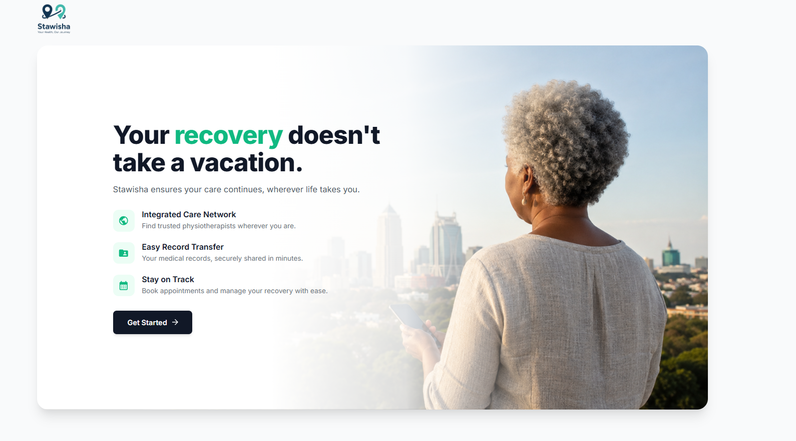

# Stawisha: A Web-Based Physiotherapy Referral and Continuity of Care System for Travelling Patients



Welcome to the **Stawisha** repository! Stawisha is a modern, containerized healthcare platform designed to bridge the gap in continuous care. It seamlessly connects traveling patients with qualified physiotherapists, while providing administrators with a powerful, centralized dashboard to manage professional verifications and track platform analytics.

---

##  Features

- **Patient Portal:** Register, request transfers and track physiotherapy referrals.
- **Physiotherapist Dashboard:** Secure login, manage patient records and update treatment plans.
- **Admin Dashboard:** Monitor platform statistics, verify new physiotherapist credentials and manage users.
- **Secure Authentication:** JWT-based secure login and registration system.
- **Fully Dockerized:** Easy to run anywhere using Docker and Docker Compose.

---

##  Tech Stack

- **Frontend:** Next.js (React), Material UI, Tailwind CSS
- **Backend:** Node.js, Fastify API framework
- **Database:** PostgreSQL
- **Containerization:** Docker & Docker Compose

---

##  Getting Started (Beginner Friendly)

Follow these step-by-step instructions to get a copy of the project up and running on your local machine for development and testing.

### Prerequisites

Before you begin, ensure you have the following installed:
1. **[Git](https://git-scm.com/downloads)** (To clone the code)
2. **[Docker Desktop](https://www.docker.com/products/docker-desktop/)** (To run the servers and database without installing them manually)

### Step 1: Clone the Repository

Open your terminal (Command Prompt, PowerShell, or Git Bash) and run:

```bash
git clone https://github.com/natalieabwoga/Stawisha.git
cd Stawisha
```

### Step 2: Configure Environment Variables

The backend needs some secret keys to run (like database passwords and authentication keys). 

1. Navigate to the `backend` folder.
2. Find the file named `.env.example`.
3. Copy it and rename the copy to exactly `.env`.
   
   *(If you are using the terminal, you can just run this command):*
   ```bash
   cp backend/.env.example backend/.env
   ```

### Step 3: Build and Run the App

Make sure **Docker Desktop** is open and running in the background. Then, in the root directory of the project (the `Stawisha` folder), run:

```bash
docker-compose up --build -d
```

*Note: This might take a few minutes the very first time as it downloads the database and server environments.*

### Step 4: Access the Application

Once the terminal says the containers are running, open your web browser!

-  **Frontend (The App):** [http://localhost:3002](http://localhost:3002)
-  **Backend (The API):** [http://localhost:3001](http://localhost:3001)

*The backend will automatically create the database tables and add default admin users when it starts up!*

---

##  Stopping the Application

When you are done testing, you can safely shut down the servers by running:

```bash
docker-compose down
```

*(If you ever want to completely wipe the database and start fresh, run `docker-compose down -v`)*

---

##  Troubleshooting

- **"Ports are already in use" error:** Make sure you don't have another PostgreSQL instance or React app running on ports `5434`, `3001`, or `3002`.
- **Changes aren't showing up:** The frontend supports hot-reloading. However, if you make changes to the backend `package.json` or Dockerfiles, you will need to stop the app and rebuild it using `docker-compose up --build`.
